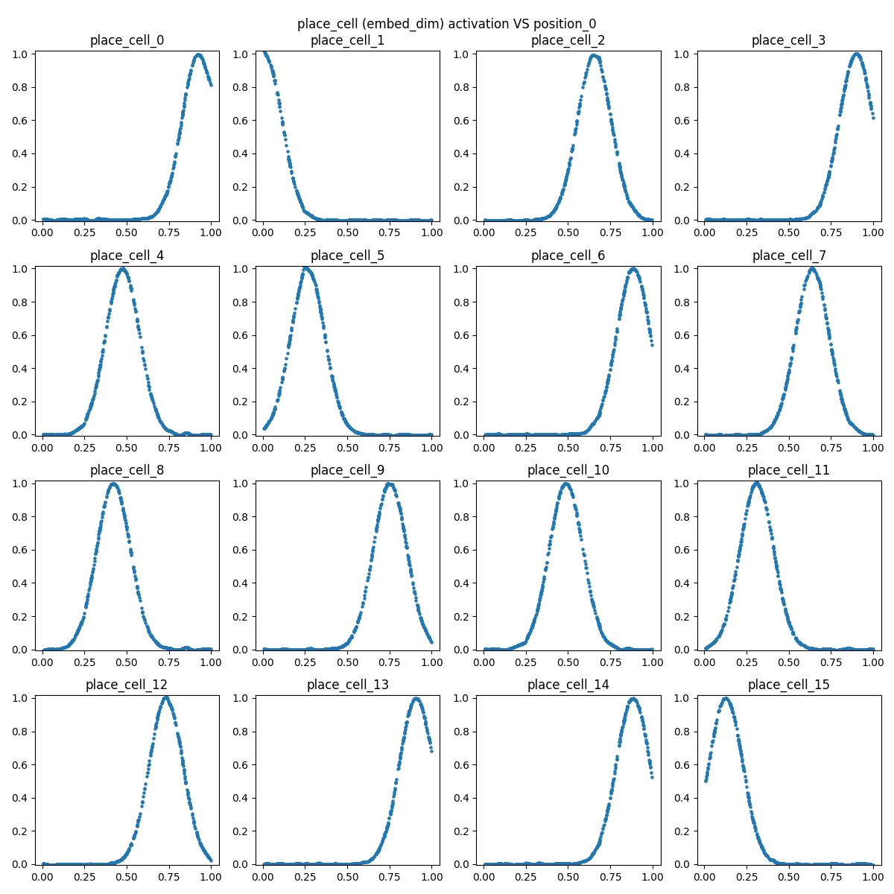
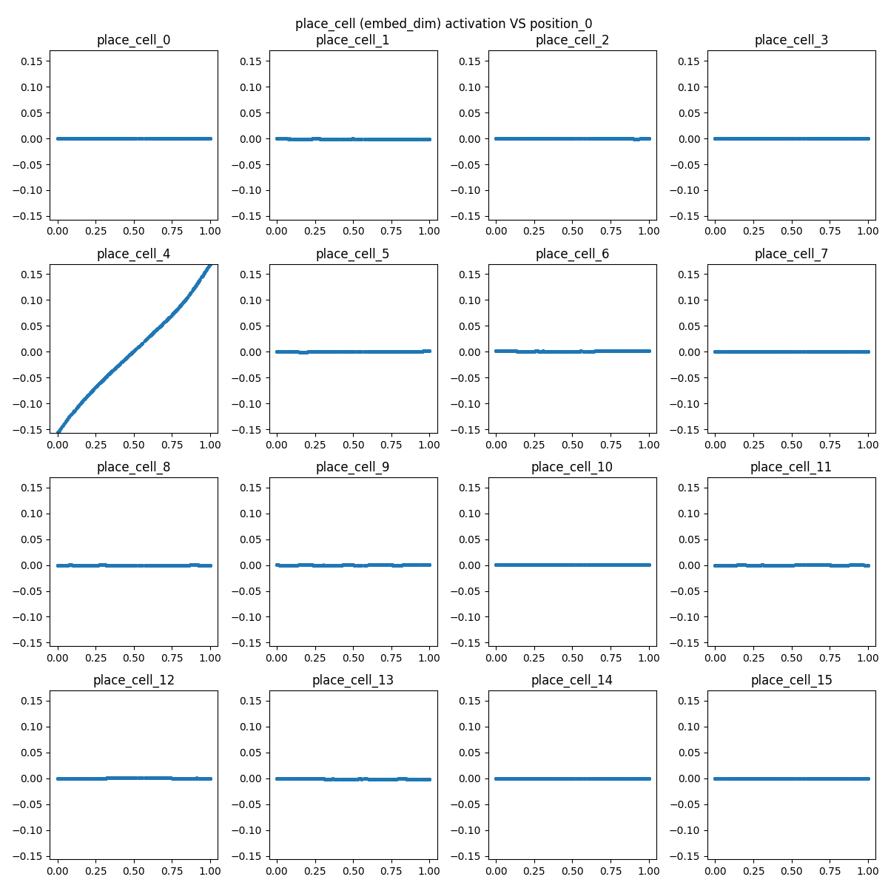

## Hippocampal Place Cells (2014 Nobel Prize)

```py
from brain_modules.hippocampus.PlaceCells import (
    HippocampalPlaceCells,
    supervised_learning,
    unsupervised_learning,
)
```

```bash
HippocampalPlaceCells(
  (encoder): Sequential(
    (0): Linear(in_features=1, out_features=128, bias=True)
    (1): ReLU()
    (2): Linear(in_features=128, out_features=128, bias=True)
    (3): ReLU()
    (4): Linear(in_features=128, out_features=16, bias=True)
  )
  (decoder): Sequential(
    (0): Linear(in_features=16, out_features=128, bias=True)
    (1): ReLU()
    (2): Linear(in_features=128, out_features=128, bias=True)
    (3): ReLU()
    (4): Linear(in_features=128, out_features=1, bias=True)
  )
  (predictor): Sequential(
    (0): Linear(in_features=17, out_features=128, bias=True)
    (1): ReLU()
    (2): Linear(in_features=128, out_features=128, bias=True)
    (3): ReLU()
    (4): Linear(in_features=128, out_features=16, bias=True)
  )
)
```

### Supervised Learning

- `observation -> MLP -> position embedding` (each dim of the embedding is a place cell!)
- The MLP is trained such that place cells respond to observations (positions) with Gaussian
- Note: animals cannot take `coordinates` as inputs, we only have `visual observations`,
  and we learn about our positions by transforming these observations into `embeddings`
  (physical coordinates encoded as high dimensional vectors)



### Unsupervised Learning (World Model)
    
- `encoder: observation -> MLP -> position embedding`
- `decoder: position embedding -> MLP -> observation`
- `predictor: (embedding, action) -> MLP -> next embedding`

- Failures:
    - I didn't manage to produce `Gaussian response`
    - The responses degenerate to `linear` at one place cell, while others give `zero` (due to `sparsity loss`)


