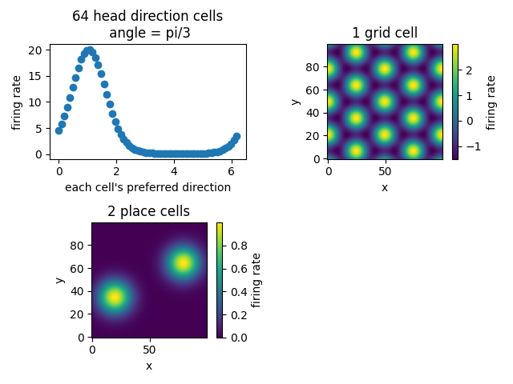
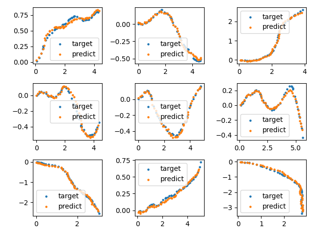

## Brain's GPS System

**TODO**: make biological firing patterns emerge from ANN

```py
from brain_modules.systems.BrainGPS import BrainGPS, learn_path_integration_2d
```

### Neural Computations

1. Head Direction Cells
    - Each cell corresponds to a preferred direction, its firing rate is max when the animal's head faces that direction
    - The cell population encodes any arbitrary direction as a vector
    - **Computation**: integrates `angular velocity` to get current **allocentric** `head direction`
    - **Note**: Head direction != head-body rotation. And we assume head direction = movement direction for simplicity

2. Grid Cells
    - Each cell's response forms a hexagonal grid, its firing rate is max when the animal goes to these grid points
    - Each cell in the population has different `spatial frequency`, essentially forming `Fourier basis`, the cell population encodes any arbitrary location as a vector
    - **Computation**: integrates the animal's `linear velocity` (with `head direction` info) to get `current location`
    - **Note**: The grids are internally generated via path integration, but are **anchored** to the environment when `environmental cues` are available

3. Place Cells
    - Each cell corresponds to a preferred location, its firing rate is max when the animal goes to that location
    - The cell population encodes an arbitrary location as a vector
    - **Computation**: decodes the location representation from grid cell population



### PyTorch Replication

- Model: `GRU (Gated Recurrent Unit)` for **sequence prediction** (path integration)
    - Input: a sequence of `(linear_velocity, angular_velocity)` (animal's internal/**egocentric** knowledge)
    - Output: a sequence of `(x, y, head_direction)`


